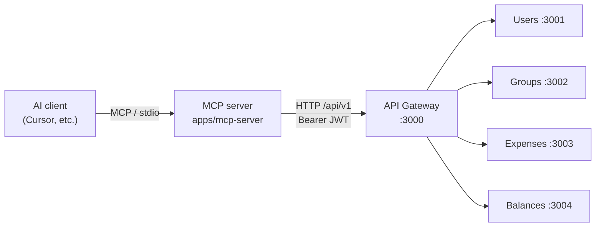
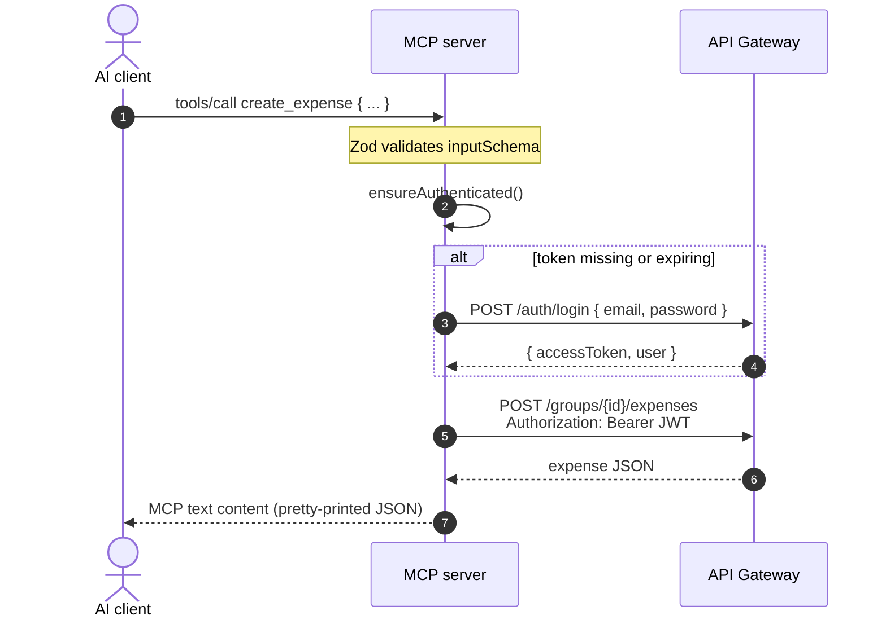

# MCP server architecture

How the expense-splitter MCP server exposes the REST API to AI clients (Cursor, Claude Desktop, etc.) via the [Model Context Protocol](https://modelcontextprotocol.io/).

The MCP server is a thin adapter: it speaks MCP over stdio on one side and HTTP/JSON to the API gateway on the other. It does not talk to downstream microservices directly and does not own any data.

---

## 1. Position in the stack



| Layer | Responsibility |
|-------|----------------|
| **AI client** | Discovers tools, invokes them with structured arguments |
| **MCP server** | Maps each tool to a gateway REST call; manages login and JWT refresh |
| **API gateway** | Auth, validation, membership checks, routing to internal services |
| **Microservices** | Domain logic and persistence (unchanged by MCP) |

From the gateway's perspective, the MCP server is just another HTTP client — identical to the web app, but authenticated with a fixed service account (`EXPENSE_SPLITTER_EMAIL` / `EXPENSE_SPLITTER_PASSWORD`).

---

## 2. Package layout

```
apps/mcp-server/
├── src/
│   ├── index.ts           # Boot: create McpServer, register tools, serve stdio
│   ├── config.ts          # Load env (gateway URL, credentials)
│   ├── gateway-client.ts  # Login, JWT lifecycle, HTTP requests to gateway
│   └── register-tools.ts  # Tool definitions (Zod schemas + handlers)
├── package.json
└── tsconfig.json
```

| Module | Role |
|--------|------|
| `index.ts` | Wires `McpServer` + `GatewayClient` + `registerTools`, then calls `serveStdio` so the host process communicates over stdin/stdout |
| `config.ts` | Reads `EXPENSE_SPLITTER_URL`, `EXPENSE_SPLITTER_EMAIL`, `EXPENSE_SPLITTER_PASSWORD`; fails fast if credentials are missing |
| `gateway-client.ts` | Single HTTP client for all gateway calls; handles login, token expiry, and 401 retry |
| `register-tools.ts` | Declares MCP tools with Zod `inputSchema` and delegates each handler to `client.request()` |

---

## 3. Request lifecycle



Every tool handler follows the same path:

1. **Validate** — `@modelcontextprotocol/server` validates arguments against the Zod schema registered with the tool.
2. **Authenticate** — `GatewayClient.ensureAuthenticated()` logs in or refreshes the JWT if needed.
3. **Call gateway** — `client.request(method, path, body?)` sends the REST request.
4. **Return** — Response JSON is stringified and returned as MCP `text` content.

On **401**, the client clears the token, re-logs in, and retries the request once.

---

## 4. Authentication

The MCP server uses **password login**, not per-session user OAuth:

1. On first API call (or when the JWT is expired), `GatewayClient` POSTs to `/auth/login`.
2. The access token is stored in memory for the process lifetime.
3. Expiry is read from the JWT payload (`exp` claim); the token is refreshed one minute before expiry.
4. Concurrent login attempts are deduplicated via a shared `loginPromise`.

Implications:

- All MCP tool calls run as the configured user (e.g. `alice@example.com`).
- Authorization rules are the same as the REST API (group membership, settlement `fromUserId`, etc.).
- Credentials live in environment variables — never commit real passwords; use `.cursor/mcp.json` or host-specific secret config.

---

## 5. Tool catalog

Each MCP tool maps 1:1 to a gateway endpoint. Responses are always JSON text.

| MCP tool | HTTP | Gateway path |
|----------|------|--------------|
| `get_me` | GET | `/auth/me` |
| `list_groups` | GET | `/groups` |
| `get_group` | GET | `/groups/:groupId` |
| `create_group` | POST | `/groups` |
| `add_group_member` | POST | `/groups/:groupId/members` |
| `list_expenses` | GET | `/groups/:groupId/expenses` |
| `create_expense` | POST | `/groups/:groupId/expenses` |
| `get_balances` | GET | `/groups/:groupId/balances` |
| `list_settlements` | GET | `/groups/:groupId/settlements` |
| `create_settlement` | POST | `/groups/:groupId/settlements` |

Tool descriptions and parameter shapes are defined in `register-tools.ts`. Split rules for `create_expense` mirror the gateway API: `equal`, `exact`, or `percentage` with per-member `userId` and optional `amount` / `percentage`.

Errors from the gateway (4xx/5xx) are thrown as `Error` with status and body text; the MCP host surfaces these to the agent.

---

## 6. Transport and protocol

- **Protocol:** MCP (tools only in v0.1 — no resources or prompts).
- **Transport:** stdio (`serveStdio` from `@modelcontextprotocol/server/stdio`).
- **Server identity:** `name: expense-splitter`, `version: 0.1.0`.

The host process (Cursor) spawns `node apps/mcp-server/dist/index.js` and exchanges JSON-RPC messages over the child process's stdin/stdout. No HTTP port is opened by the MCP server itself.

---

## 7. Configuration

Environment variables (see `.env.example`):

| Variable | Default | Description |
|----------|---------|-------------|
| `EXPENSE_SPLITTER_URL` | `http://localhost:3000/api/v1` | Gateway base URL |
| `EXPENSE_SPLITTER_EMAIL` | *(required)* | Service account email |
| `EXPENSE_SPLITTER_PASSWORD` | *(required)* | Service account password |

### Cursor

Project-level MCP config lives in `.cursor/mcp.json`:

```json
{
  "mcpServers": {
    "expense-splitter": {
      "command": "node",
      "args": ["apps/mcp-server/dist/index.js"],
      "env": {
        "EXPENSE_SPLITTER_URL": "http://localhost:3000/api/v1",
        "EXPENSE_SPLITTER_EMAIL": "alice@example.com",
        "EXPENSE_SPLITTER_PASSWORD": "password123"
      }
    }
  }
}
```

Build before the host starts the server (`npm run mcp:build`), or point `args` at `tsx src/index.ts` for development.

---

## 8. Local development

Prerequisites: gateway and downstream services running (see [REQUEST_FLOW.md](./REQUEST_FLOW.md)).

```bash
# Install MCP server dependencies
npm run mcp:install

# Build (required for .cursor/mcp.json node dist/ path)
npm run mcp:build

# Or run directly with tsx (no build)
npm run mcp:dev
```

Root `package.json` scripts:

| Script | Command |
|--------|---------|
| `mcp:install` | `npm --prefix apps/mcp-server install` |
| `mcp:build` | `npm --prefix apps/mcp-server run build` |
| `mcp:dev` | `npm --prefix apps/mcp-server run dev` |

After changing tool definitions or client logic, rebuild and restart the MCP server in Cursor (or reload the window) so the host picks up the new binary.

---

## 9. Design choices

**Why a separate app instead of gateway MCP routes?**

- Keeps the gateway focused on HTTP for humans and the web UI.
- MCP stdio fits the Cursor/Claude Desktop spawn model without exposing another port.
- Tool schemas (Zod) and MCP SDK concerns stay isolated in `apps/mcp-server`.

**Why login instead of a static API key?**

- Reuses existing JWT auth; no new gateway auth mechanism.
- Same authorization and audit trail as normal API usage.

**Why JSON text responses?**

- Simple and debuggable for agents; no custom MCP resource types yet.
- Matches gateway response bodies verbatim.

**Not in scope (v0.1)**

- MCP resources (e.g. live balance subscriptions)
- Multi-user / per-session credentials inside one MCP process
- SSE or HTTP MCP transport (stdio only)

---

## 10. Related docs

- [SOFTWARE_DESIGN.md](./SOFTWARE_DESIGN.md) — domain model, service boundaries, REST API reference
- [REQUEST_FLOW.md](./REQUEST_FLOW.md) — how gateway requests reach microservices and events update balances
