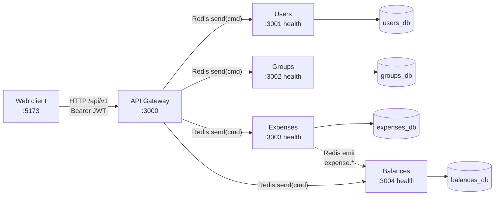
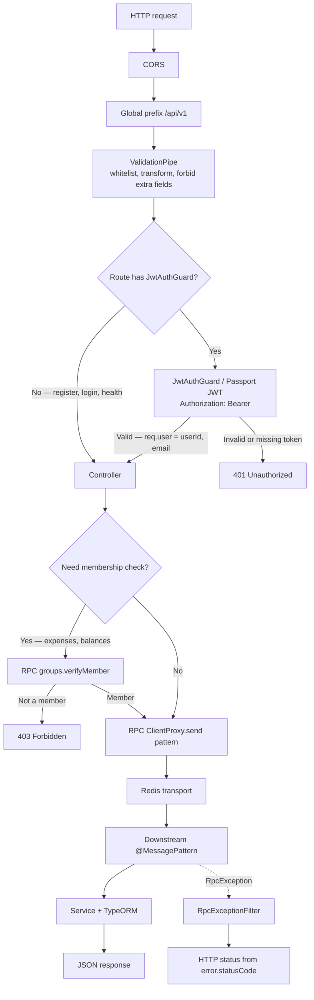
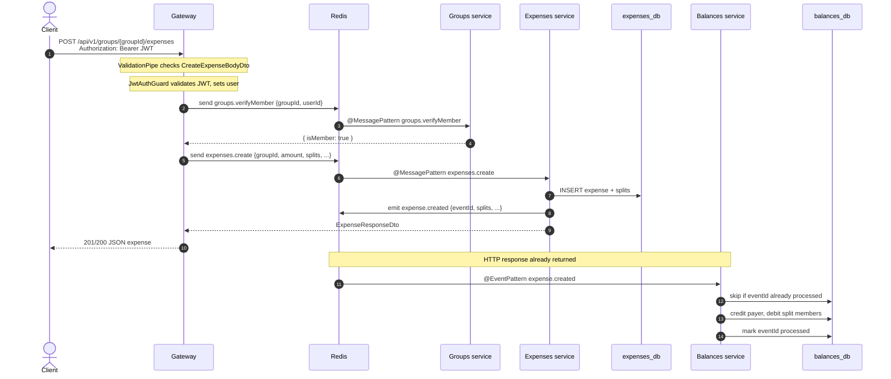
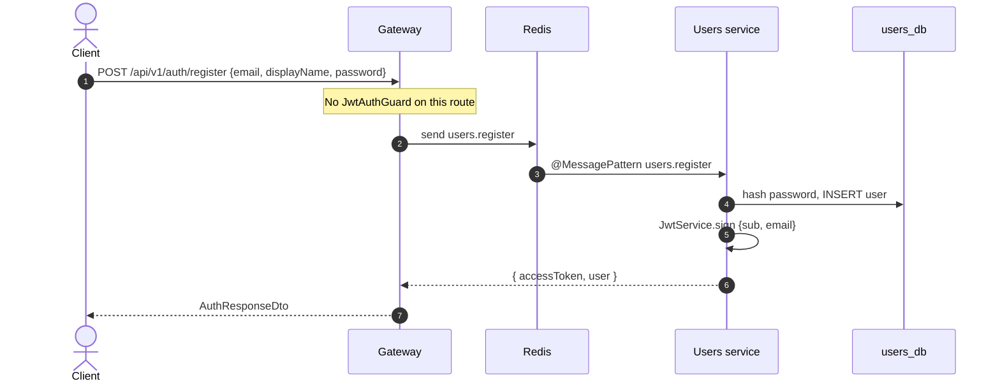
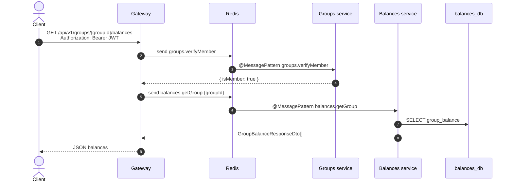
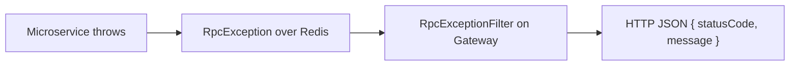

# Request flow through the NestJS backend

How an HTTP request travels from the web client through the API gateway into the microservices, and how writes fan out as domain events.

The gateway is the only HTTP API clients talk to (`:3000`, prefix `/api/v1`). Downstream services (Users, Groups, Expenses, Balances) listen on Redis for request/response messages and keep their own PostgreSQL databases. Expenses also publishes fire-and-forget events that Balances consumes to update its read model.

---

## 1. Services and transports

**Sync path:** `ClientProxy.send({ cmd })` — request/response over Redis. The gateway waits with `firstValueFrom(...)`.

**Async path:** `eventBus.emit('expense.created' | 'expense.updated' | 'expense.deleted')` — fire-and-forget. Balances handlers are idempotent via a `processed_event` table.

Health checks (`GET /health`) hit each service's HTTP port directly and do not go through Redis.

---

## 2. Gateway pipeline (every HTTP request)

Public routes: `POST /auth/register`, `POST /auth/login`, `GET /health`. Everything else under `/api/v1` requires a JWT.

---

## 3. Example: create an expense

This is the richest path: auth, a membership RPC, a command RPC, a database write, then an async event that updates balances **after** the HTTP response.

The client may see stale balances for a short window. A later `GET /api/v1/groups/{groupId}/balances` reads the updated snapshot from Balances.

---

## 4. Example: register (no JWT)

Login is the same shape (`users.login`). The Users service issues the JWT; the gateway only verifies it on later requests via Passport (`JwtStrategy`).

---

## 5. Example: read balances (query, no event)

Settlements are a **command** on Balances (`settlements.create`) that writes `settlements` and adjusts `group_balance` in the same request — they do not go through Expenses or domain events.

---

## 6. Errors

Downstream services throw Nest HTTP exceptions (`NotFoundException`, `ConflictException`, …). Over Redis those surface as `RpcException`. The gateway's global `RpcExceptionFilter` maps `{ statusCode, message }` back to an HTTP response so the client still sees a normal REST error.

---

## Message patterns (quick reference)

| Direction | Pattern | Used by |
|-----------|---------|---------|
| Gateway → Users | `users.register`, `users.login`, `users.findById`, `users.findByEmail` | Auth, add-member-by-email |
| Gateway → Groups | `groups.create`, `groups.findById`, `groups.listForUser`, `groups.addMember`, `groups.removeMember`, `groups.verifyMember` | Groups CRUD + membership gates |
| Gateway → Expenses | `expenses.create`, `expenses.findById`, `expenses.listByGroup`, `expenses.update`, `expenses.delete` | Expense CRUD |
| Gateway → Balances | `balances.getGroup`, `settlements.create`, `settlements.listByGroup` | Reads and settlements |
| Expenses → Balances (event) | `expense.created`, `expense.updated`, `expense.deleted` | Balance read model |
