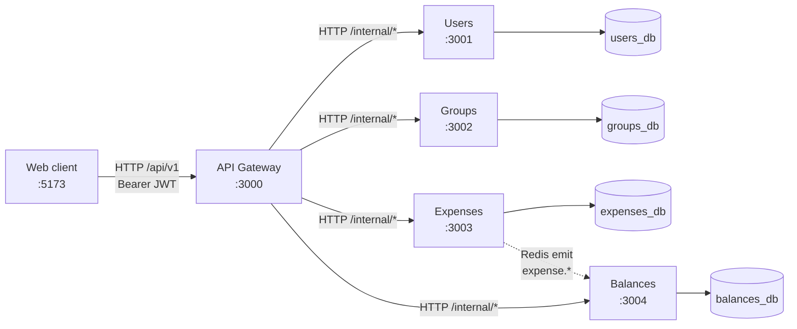
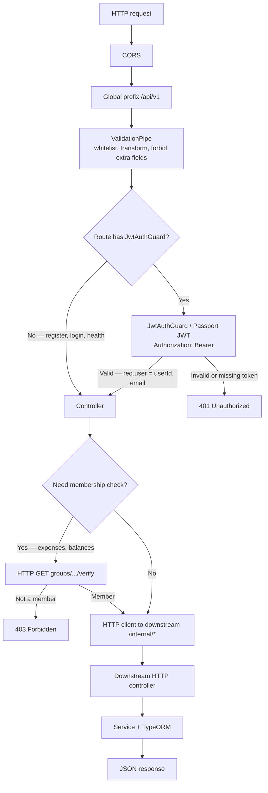
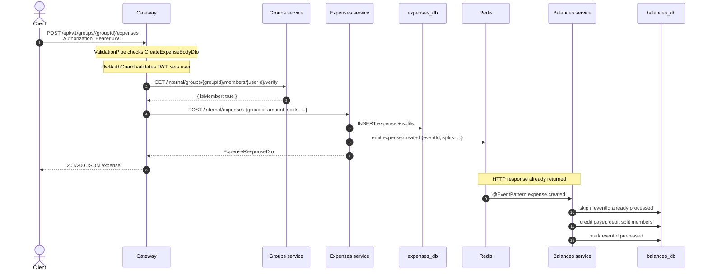
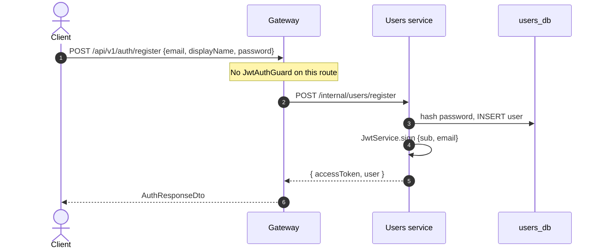
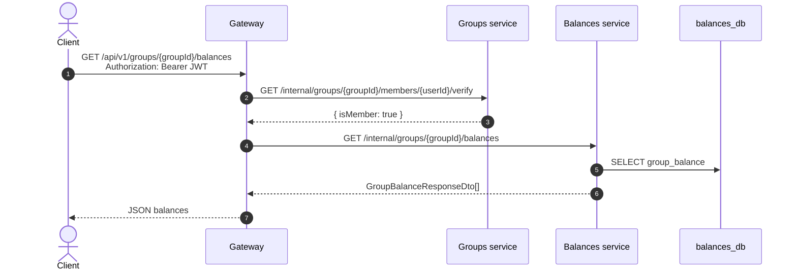

# Request flow through the NestJS backend

How an HTTP request travels from the web client through the API gateway into the microservices, and how writes fan out as domain events.

The gateway is the only **public** HTTP API clients talk to (`:3000`, prefix `/api/v1`). Downstream services expose internal HTTP endpoints on `:3001`–`:3004` (protected by `X-Internal-Token`) and keep their own PostgreSQL databases. Expenses also publishes fire-and-forget events over Redis that Balances consumes to update its read model.

---

## 1. Services and transports

**Sync path:** Gateway typed HTTP clients (`UsersClient`, `GroupsClient`, …) call `/internal/*` routes on each service. Errors propagate as normal HTTP status codes.

**Async path:** `eventBus.emit('expense.created' | 'expense.updated' | 'expense.deleted')` — fire-and-forget over Redis. Balances handlers are idempotent via a `processed_event` table.

Health checks (`GET /health`) are public on each service's HTTP port.

---

## 2. Gateway pipeline (every HTTP request)

Public routes: `POST /auth/register`, `POST /auth/login`, `GET /health`. Everything else under `/api/v1` requires a JWT.

---

## 3. Example: create an expense

This is the richest path: auth, a membership check, an internal HTTP call, a database write, then an async event that updates balances **after** the HTTP response.

The client may see stale balances for a short window. A later `GET /api/v1/groups/{groupId}/balances` reads the updated snapshot from Balances.

---

## 4. Example: register (no JWT)

Login is the same shape (`POST /internal/users/login`). The Users service issues the JWT; the gateway only verifies it on later requests via Passport (`JwtStrategy`).

---

## 5. Example: read balances (query, no event)

Settlements are a **command** on Balances (`POST /internal/groups/{groupId}/settlements`) that writes `settlements` and adjusts `group_balance` in the same request — they do not go through Expenses or domain events.

---

## 6. Errors

Downstream services throw Nest HTTP exceptions (`NotFoundException`, `ConflictException`, …). The gateway HTTP clients surface these as `HttpException` with the same status code and message, so the client still sees a normal REST error.

---

## Internal routes (quick reference)

| Direction | Route | Used by |
|-----------|-------|---------|
| Gateway → Users | `POST /internal/users/register`, `login`; `GET /internal/users/:id`, `by-email` | Auth, add-member-by-email |
| Gateway → Groups | `POST/GET /internal/groups`, `GET .../verify`, members CRUD | Groups CRUD + membership gates |
| Gateway → Expenses | `POST/PATCH/DELETE /internal/expenses`, `GET .../groups/:id/expenses` | Expense CRUD |
| Gateway → Balances | `GET/POST /internal/groups/:id/balances`, `.../settlements` | Reads and settlements |
| Expenses → Balances (event) | `expense.created`, `expense.updated`, `expense.deleted` | Balance read model |

All internal routes require `X-Internal-Token` (see `INTERNAL_SERVICE_TOKEN` in `.env`).
